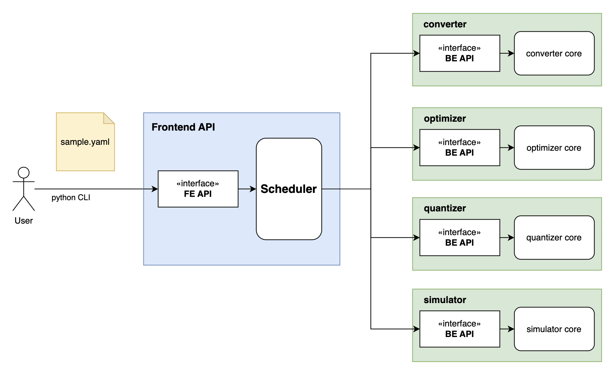

# Introduction to Exynos AI High-Level Toolchain (EHT)

**EHT** is a software that provides optimization techniques for neural networks, including computer vision (CV) models, large language models (LLM), and large vision models (LVM). This software takes models as input and offers functionalities such as quantization and model optimization to generate SNC models.

## System overview diagram

