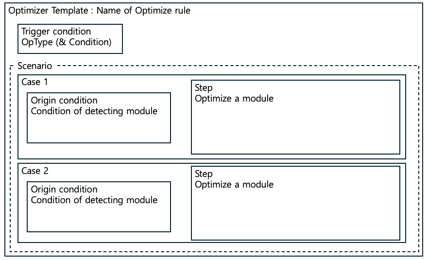
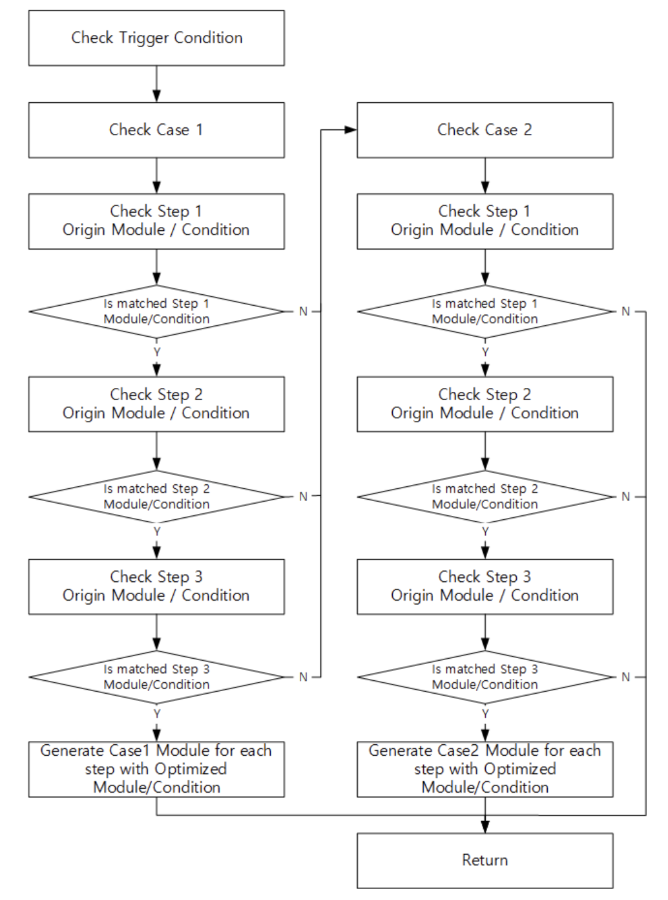

# Optimizer

Models are trained and generated on floating-point hardware like CPUs and GPUs. These devices generally perform well, but not for chips due to hardware constraints. Optimizer provides optimization methods for these models to perform best on Exynos chips. Optimizer supports three powerful features.

- shape_inference  
If the input shape is not specified or need to be changed, shape_inference allows the user to define/modify it.
- 4dim conversion  
In order for the .nnc extension model to operate on a device, the input and output shapes of all operators in the model must be in four dimensions.
- support optimization method.  
Optimizer supports many optimization features so that the model works efficiently on the device.
    - Fold
        - GeGLU
        - GroupNorm
        - LayerNorm
        - PReLU
        - RMSNorm
    - Fuse
        - SiLU
        - BatchNorm into Convolution
        - Cast
        - Deconvolution bias
        - Math
    - Insert
        - Depthwise Convolution for activation
    - Replace
        - Average Pooling to Depthwise convolution
        - Eltwise concat convolution
        - Convolution kernel 1 to 3
        - Matrix multiplication to dynamic convolution
        - ReduceMean to Global average pool
        - ReduceSum to Convolution
        - Slice to Split
    - Change attribute
        - axis of softmax

In addition, Optimizer Template, one of the Optimizer's powerful features, supports custom optimization methods that users have.

## How to Create Custom Templates

Optimizer is a tool that allows users to easily optimize their models. Users can add their own optimization methods using the "Optimizer Template" of Optimizer. The following process is required to apply the user-defined template to the user model.

- Create custom templates.
- Prepare model to be optimized
- Validate optimized model

### Optimizer Template

The Optimizer template provides a scenario of how the model should be optimized. Its components are shown in the figure below.



Optimization Template Component

- Optimize Name: Name of the optimization you want to apply
- Trigger condition : Trigger condition for starting application of the Optimization technique in graph search (typically, the trigger condition is the operator type)
- Origin Module: Module before optimization
- Origin condition: Check that the Origin Module is candidate to this optimization technique (applied if trigger condition is triggered)
- Optimized Module: Module after optmization
- Optimization: Modification condition of Optimized applied model (optional)

### Flow

The Optimizer Templates are executed as shown in the flow chart below. In searching for the model, the node meets the trigger_op method of the template for the first time. Then it loops through the origin_condition of the case. If the condition is correct, it optimizes the module through steps.



### Create custom templates

In this part, we introduce how to write custom templates step by step. As an example, we use a template that fuses basic arithmetic operations layers into a convolution layer, when possible. We provide `TemplateStepInternal`, `TemplateCaseInternal`, `OptimizerTemplateInternal` to prevent abnormal behavior of the code.

```python
class TemplateStepInternal(TemplateStep):     
    @property
    def name(self) -> AnyStr:
        return self._name
    
    @name.setter
    def name(self, value: AnyStr):
        self._name = value
    
    @property
    def origin(self) -> Dict:
        return self._origin
    
    @origin.setter
    def origin(self, value: Dict):
        self._origin = value
    
    def optimization(self, model: CnnxModel, node: CnnxNode) -> Union[Tuple[List[CnnxNode], List[CnnxNode], List[Port], List[Port]], Dict]:
        return NotImplementedError

    
class TemplateCaseInternal(TemplateCase):
    @property
    def name(self) -> AnyStr:
        return self._name
    
    @name.setter
    def name(self, value: AnyStr):
        self._name = value
    
    @property
    def origin(self) -> Dict:
        return self._origin
    
    @origin.setter
    def origin(self, value: Dict):
        self._originn = value
    
    @property
    def step_list(self) -> Dict:
        return self._step_list
    
    @step_list.setter
    def step_list(self, value: Dict):
        self._step_list = value
        
    def origin_condition(self, model: CnnxModel, node: CnnxNode) -> bool:
        raise NotImplementedError
    
    def launch(self, model: CnnxModel, node: CnnxNode) -> bool:
        if self.origin_condition(model, node):
            for st in self.step_list:
                if not st.optimization(model, node):
                    return False
            return True
    
        
        
class OptimizerTemplateInternal(OptimizerTemplate):
    def __repr__(self):
        return '{}(name={})'.format(
            self.__class__.__name__, self.name)
    
    @property
    def name(self) -> AnyStr:
        return self._name
    
    @name.setter
    def name(self, value: AnyStr):
        self._name = value
    
    @property
    def case_list(self) -> List[TemplateCaseInternal]:
        return self._case_list
    
    @case_list.setter
    def case_list(self, value: List[TemplateCaseInternal]):
        self._case_list = value
    
    def trigger_op(self, node: CnnxNode) -> bool:
        raise NotImplementedError
    
    
    def launch(self, model: CnnxModel, node: CnnxNode) -> bool:
        if self.trigger_op(node):
            for case in self.case_list:
                if case.launch(model, node):
                    return True
        return False
```

Inherit the above classes and declare each class corresponding to Step, Case, and Template. Import package classes of model_editor for updating the model. If you need more information about model_editor, please see the guide about model_editor.

We **activate the trigger_op method** when the node is one of the four basic arithmetic operators and the input feature map has 4 dimension. In the **origin_condition method of the case class**, more detailled conditions are checked: the previous node of the arithmetic operator must be a convolution layer, the arithmetic operator must be the only node following the convolution node, and it must not be folded yet.
In the **optimization method of Step class**, update the value of the convolution node using the value of the arithmetic node. Once the value has been updated, you no longer need the original node. Create a port to clear the node from the graph. update the model using the port you created. First, remove the node from the model. Then, connect the next node of the removed node to the convolution node.

```python
# That classes prevent the abnormal behavior of the code
from optimizer.core.templates.base.template_internal import (
    TemplateStepInternal,
    TemplateCaseInternal,
    OptimizerTemplateInternal
)
# These packages have the ability to add, delete, and update nodes of the model.
# Please see the guide about model_editor for more information.
from model_editor import (
    CnnxNode, 
    CnnxModel,
    OnnxOperator, 
    CnnxInOut, 
    CnnxDtype, 
    CnnxAttribute,
    Port
)
# declare Step class
class StepFuseMath(TemplateStepInternal):
    def __init__(self):
        self.name = 'Step Fusing Math'
    # create bias 
    def make_bias_input(self, node: CnnxNode):
        bias_shape = node.inputs[1].shape[0]
        bias_data = np.zeros(shape=bias_shape)
        return CnnxInOut(
                name=f"{node.name}_bias",
                type=CnnxDtype.FLOAT,
                shape=[bias_shape],
                data=bias_data
            )
    
    def optimization(self, model: CnnxModel, node: CnnxNode) -> bool:
        # model : model 
        # node : triggered node. in case, one of Add, Sub, Mul, Div node with constants value
        parent_conv = node.prev_nodes[0]
        if node.op_type == 'Add':
            # if node doesn't have bias
            if len(parent_conv.inputs) != 3:
                parent_conv.inputs.append(self.make_bias_input(parent_conv))
            # update bias
            parent_conv.inputs.data[2].data = parent_conv.inputs.data[2].data + node.inputs.data[1].data
        elif node.op_type == 'Sub':
            if len(parent_conv.inputs) != 3:
                parent_conv.inputs.append(self.make_bias_input(parent_conv))
            parent_conv.inputs.data[2].data = parent_conv.inputs.data[2].data - node.inputs.data[1].data
        elif node.op_type == 'Mul':
            parent_conv.inputs.data[1].data = parent_conv.inputs.data[1].data * node.inputs.data[1].data
            if len(parent_conv.inputs) == 3:
                parent_conv.inputs.data[2].data = parent_conv.inputs.data[2].data * node.inputs.data[1].data
        elif node.op_type == 'Div':
            parent_conv.inputs.data[1].data = parent_conv.inputs.data[1].data / node.inputs.data[1].data
            if len(parent_conv.inputs) == 3:
                parent_conv.inputs.data[2].data = parent_conv.inputs.data[2].data / node.inputs.data[1].data
        # copy quantization, name, shape of output of node.
        parent_conv.outputs[0] = deepcopy(node.outputs[0])

        # set for connecting conv node & the next node of node.
        connections = []
        for next_node in node.next_nodes:
            for output_tensor in node.outputs:
                port_from = Port(node.prev_nodes[0].name, 0)
                port_to = Port(next_node.name, next_node.inputs.data.index(output_tensor))
                connections.append((port_from, port_to))
        # execute to update model
        for connection in connections:
            model.nodes.connect(connection[0], connection[1])
        try:
            model.nodes.remove(node)
            for connection in connections:
                model.nodes.connect(connection[0], connection[1])
            print(f'[INFO] Fuse DeconvBias {next_node.op_type}({next_node.id}) into Deconv({node.id})')
            return True
        except Exception as e:
            print(e)
            return False
    
class CaseFuseMath(TemplateCaseInternal):
    def __init__(self):
        self.name = 'Fuse Math to DWCONV'
        self.step_list = [StepFuseMath()]
    
    # Check the number of Child of [CONV, DWCONV]
    def origin_condition(self, model: CnnxModel, node: CnnxNode) -> bool:
        if node.prev_nodes == []:
            return False
        # If Convolution layer and node only connected each other.
        if len(node.prev_nodes[0].next_nodes) == 1 and len(node.prev_nodes) == 1:
            if node.prev_nodes[0].op_type in ['Conv', 'ConvTranspose'] and \
                # If node isn't Folding.
                node.module is None:
                return True
        return False

    
class TemplateFuseMath(OptimizerTemplateInternal):
    def __init__(self):
        self.name = 'FuseMath'
        # declare Case
        self.case_list = [
            CaseFuseMath()
            ]
    '''
    according to Flow, The first thing you encounter when navigating the nodes in the graph is trigger_op. 
    In this case, it was written to operate only when the input shape of the four arithmetic operations operator 
    and a input feature map of node has 4 dimension. 
    '''
    def trigger_op(self, node: CnnxNode):
        optypes = ['Add', 'Sub', 'Mul', 'Div']
        if node.op_type in optypes:
            if len(node.inputs[0].shape) == 4 or len(node.inputs[1].shape) == 4:
                return True
        return False
```

### How to apply a custom template

Write the path of the custom template and the class name of the template. Following the above example, it can be written as follows:

```yaml
input_model_path: /ssd2/shared_data/models/kpi/denoise_model_1.5.424_1x2304x1296x3/denoise_model_1.5.424_1x2304x1296x3.onnx
output_folder_path: /home/results_denoise_1.5___
input_model_format: onnx
model_type: kpi_cv

quantizer:
    ~~~~~
simulator:
    ~~~~~~

optimizer:
    ~~~~~~
    custom_template_path:
    /usr/local/lib/python3.10/dist-packages/optimizer/core/templates/fuse_deconv_bias.py:
    - TemplateFuseDeconvBias
```
