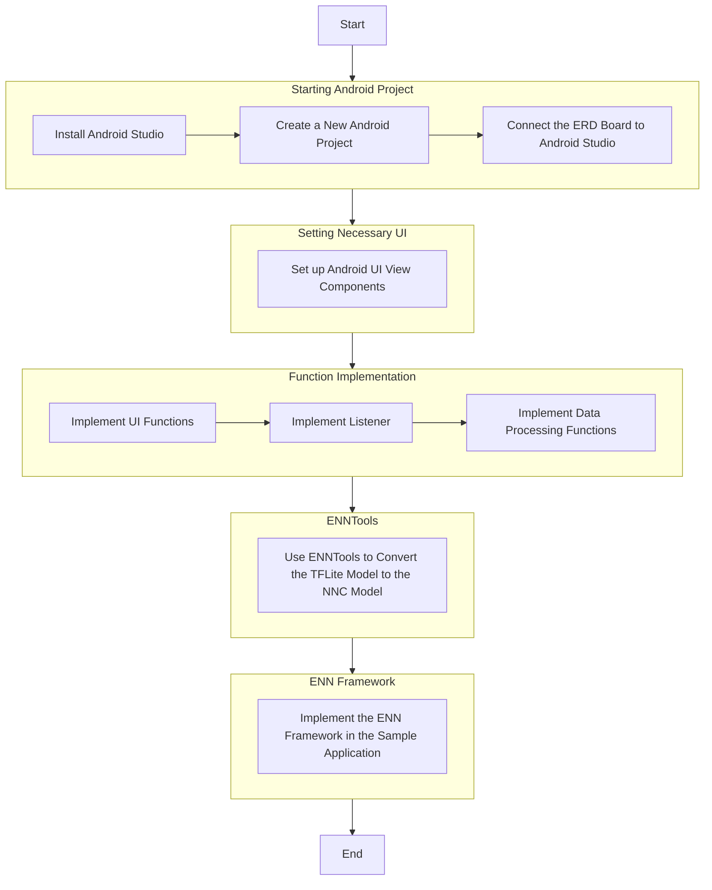

# Getting Started With Android Samples
This guide provides a comprehensive overview for developing an image classification Android application using the Exynos Neural Network Software Development Kit (ENN SDK). 
It outlines the steps for creating an application that utilizes the ENN SDK to run neural network models on Samsung Exynos hardware. 
This guide covers the important steps that also include Android project setup, function implementation, and NNC model conversion. 
The guide aims at equipping developers with the necessary knowledge to use the ENN SDK in their Android applications.

## ENN SDK
The [ENN SDK](https://soc-developer.semiconductor.samsung.com/development/enn-sdk) provides a tool for converting [TensorFlow Lite](https://www.tensorflow.org/lite) neural network models into models in Neural Network Container (NNC) format.
This conversion allows the NN models to operate efficiently on the [Samsung Exynos](https://semiconductor.samsung.com/processor/) hardware, to ensure optimal performance. 
The ENN SDK provides a framework that facilitates the execution of NNC models on the Exynos platform.

## Overview of Sample Application
The sample application takes input from a camera feed or an image, and classifies the object in the input. 
It also leverages the ENN SDK to efficiently execute the NN model on the Exynos platform.

### Used NN Model
This example uses the quantized `Inception v4` TFLite model from [Kaggle Models](https://www.kaggle.com/models/tensorflow/inception/frameworks/tfLite/variations/v4-quant/versions/1) for image classification.

### Using the Sample Application
The sample application provides two modes such as camera and image. 
You can select the desired mode by tapping the corresponding icon. 
In the image mode, the application processes the selected image from your library. 
In the camera mode, the application automatically processes the camera feed.

The processed output is displayed at the bottom of the screen, as illustrated in the following example. The application displays the classified items and their scores.

## Implementing Sample Application
Implementing sample application involves the following five steps:

1. [Starting Android project](getting-started-with-android-samples/starting-android-project): Covers the basics of starting an Android project, from installing Android studio to connecting the ERD board to Android studio.
1. [Setting necessary UI](getting-started-with-android-samples/setting-necessary-ui): Provides essential information on Android UI view components.
1. [Function implementation](getting-started-with-android-samples/function-implementation): Explains the functions available in the sample application.
1. [ENN SDK service](getting-started-with-android-samples/enn-sdk-service): Provides the step-by-step process for converting the TFLite model to NNC model.
1. [ENN framework](getting-started-with-android-samples/enn-framework): Explains the implementation of the ENN framework in the sample application.

The general workflow of writing and executing an Android application using the ENN SDK is discribed in the following flowchart.

## Glossary
|Terms|Expanded Form|
|-|-|
|ENN SDK|Exynos Neural Network Software Development Kit|
|ERD Board|Exynos Reference Design Board|
|NNC|Neural Network Container|
|NN|Neural Network|
|TFLite|TensorFlow Lite|
|JNI|Java Native Interface|
|UByte|Unsigned Byte|