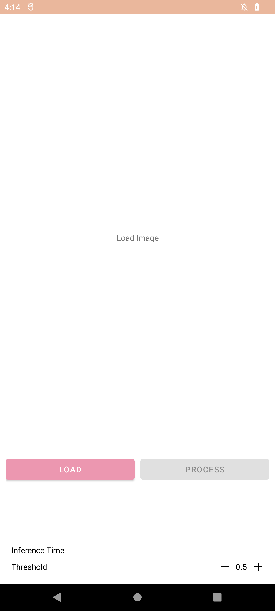
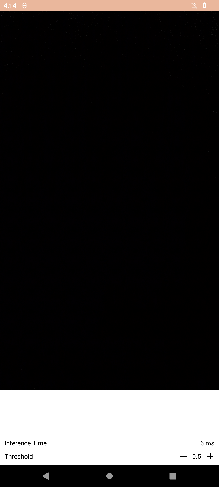

# Setting the UI Components

## Required UI Components

Following are the UI components that are required or recommended for implementation:

### Image Input
- **ImageView**: Displays the image that must be classified.
- **Image Load Button**: Triggers the loading of an image.
- **Inference Button**: Initiates the image classification process.
- **TextView**: Displays the classification result and score.

### Camera Feed Input
- **PreviewView**: Displays a live camera feed for real-time classification.
- **TextView**: Displays the classification result and score.

The implemented UI resembles the figure as illustrated below.





## Programming UI Components
This section demonstrates sample code for UI components used in the sample application.
Each component has XML code and Kotlin code pair.
Note that the code snippets provided in this guide primarily focus on the essential functional elements.
As a result, implementing additional aspects, such as the positioning of views, is mandatory.

### Text View
The TextView displays the classification result and score to the user. 
In the layout XML file, define a TextView with a unique ID. 
In the Kotlin file, use this ID to reference the TextView and set its text to the classification result and score.

- Layout `app/res/layout/*.xml` ([example](https://github.com/exynos-eco/enn-sdk-samples-9925/blob/main/image-classification/app/src/main/res/layout/enn_info.xml#L18)):
	```xml
	<TextView
		android:id="@+id/sample_text" />
	```

- Kotlin `app/java/package/fragments/Fragment.kt` ([example](https://github.com/exynos-eco/enn-sdk-samples-9925/blob/main/image-classification/app/src/main/java/com/samsung/imageclassification/fragments/CameraFragment.kt#L194)):
	```kotlin
	binding.sampleText.text = "Sample Text"
	```

### Button  
The Button triggers the image loading and inference processes. 
In the layout XML file, define a Button with a unique ID and set its text. 
In the Kotlin file, use this ID to reference the Button and set its `onClickListener` to the appropriate function.

- Layout `app/res/layout/*.xml` ([example](https://github.com/exynos-eco/enn-sdk-samples-9925/blob/main/image-classification/app/src/main/res/layout/fragment_image.xml#L28)):
	```xml
	<Button
		android:id="@+id/sample_button"
		android:text="Sample" />
	```

- Kotlin `app/java/package/fragments/Fragment.kt` ([example](https://github.com/exynos-eco/enn-sdk-samples-9925/blob/main/image-classification/app/src/main/java/com/samsung/imageclassification/fragments/ImageFragment.kt#L68)):
	```kotlin
	binding.sampleButton.setOnClickListener {
		// ... do something ... //
	}
	```

### Image View
The ImageView displays the image that is classified. 
In the layout XML file, define an ImageView with a unique ID. 
In the Kotlin file, use this ID to reference the ImageView and set its image to the selected image.

- Layout `app/res/layout/*.xml` ([example](https://github.com/exynos-eco/enn-sdk-samples-9925/blob/main/image-classification/app/src/main/res/layout/fragment_image.xml#L19)):
	```xml
	<ImageView
		android:id="@+id/sample_image" />
	```

- Kotlin `app/java/package/fragments/Fragment.kt` ([example](https://github.com/exynos-eco/enn-sdk-samples-9925/blob/main/image-classification/app/src/main/java/com/samsung/imageclassification/fragments/ImageFragment.kt#L41)):
	```kotlin
	binding.imageView.setImageBitmap(resizedImage)
	```
### Camera Preview
The PreviewView displays a live camera feed for real-time classification. 
In the layout XML file, define a PreviewView with a unique ID. 
In the Kotlin file, use this ID to reference the PreviewView and set up the camera preview.
This process involves creating a Preview object, binding it to the lifecycle of the Fragment, and setting its surface provider to the surface provider of PreviewView.

- Layout `app/res/layout/*.xml` ([example](https://github.com/exynos-eco/enn-sdk-samples-9925/blob/main/image-classification/app/src/main/res/layout/fragment_camera.xml#L9)):
	```xml
	<androidx.camera.view.PreviewView
		android:id="@+id/view_finder" />
	```

- Kotlin `app/java/package/fragments/Fragment.kt` ([example](https://github.com/exynos-eco/enn-sdk-samples-9925/blob/main/image-classification/app/src/main/java/com/samsung/imageclassification/fragments/CameraFragment.kt#L61)):
	```kotlin
	private fun setCamera() {
		cameraExecutor = Executors.newSingleThreadExecutor()

		val cameraProviderFuture = ProcessCameraProvider.getInstance(requireContext())
		cameraProviderFuture.addListener(
			{
				val cameraProvider = cameraProviderFuture.get()
				val cameraSelector = CameraSelector.DEFAULT_BACK_CAMERA

				setPreview()
				setImageAnalyzer()

				try {
					cameraProvider.unbindAll()
					camera = cameraProvider.bindToLifecycle(
						this, cameraSelector, preview, imageAnalyzer
					)

					preview?.setSurfaceProvider(binding.viewFinder.surfaceProvider)
				} catch (exc: java.lang.Exception) {
					Log.e(TAG, "Camera binding failed", exc)
				}
			}, ContextCompat.getMainExecutor(requireContext())
		)
	}

	private fun setPreview() {
		preview = Preview.Builder().setTargetRotation(binding.viewFinder.display.rotation).build()
	}
	```