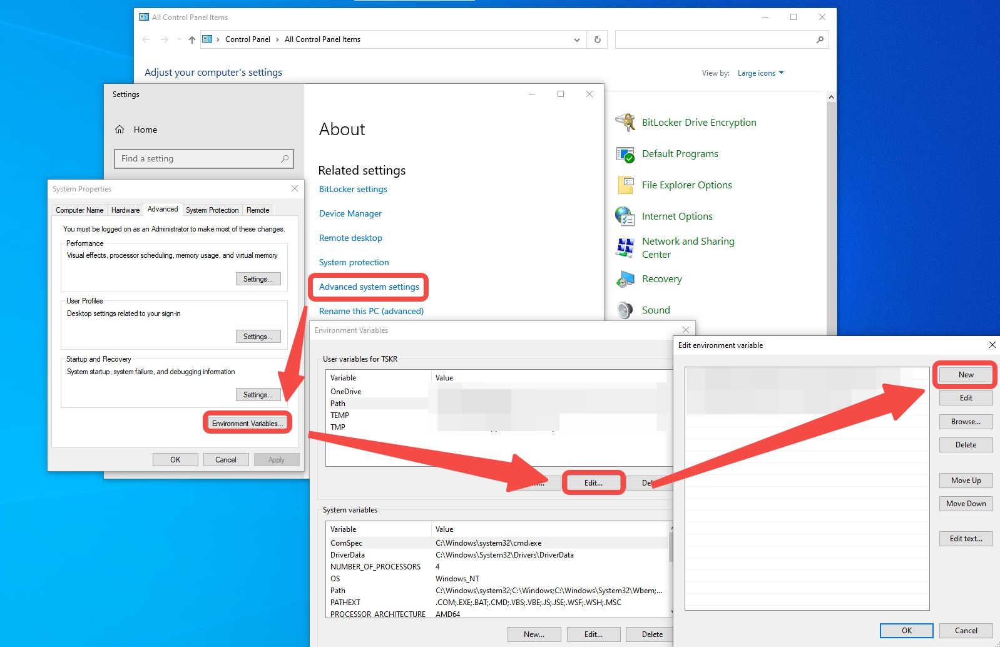

# Starting the Android Project

## Prerequisite

Before you proceed, ensure you have a basic understanding of the following Android development concepts:

- **Kotlin**: The primary programming language for Android development.
- [**View Binding**](https://developer.android.com/topic/libraries/view-binding): A feature that allows you to easily write code that interacts with views.
- [**Fragments**](https://developer.android.com/guide/fragments): A reusable piece of an user interface or behavior of Android application.
- [**Navigation Component**](https://developer.android.com/guide/navigation): A component that helps to implement navigation.

If you are new to Android, it is recommended to review Chapters 1 to 3 of the [Android Basics in Kotlin](https://developer.android.com/courses/android-basics-kotlin/course) course.
This course describes the basics of developing Android application using Kotlin.


## Installing Android Studio

1. **To Download Android studio**, visit the [official website](https://developer.android.com/studio) and click **Download Android Studio**.
1. **To install and set up Android Studio**, execute the downloaded file and follow the instructions of installation wizard.

    > For more information, such as requirement for each OS, refer to [Install Android Studio](https://developer.android.com/studio/install) from Android Developers.
1. Add the path to the Platform Tools directory in environment variables
    - Windows
        1. Navigate to Start > Control Panel > System > Advanced System Settings > Environment Variables.
        1. Select `Path` User variable, then select **Edit**.
        1. Select New and add `%USERPROFILE%\AppData\Local\Android\sdk\platform-tools` directory.
        1. Select **Ok** to close all the settings windows.

            
    - Linux (Ubuntu)
        1. Install Platform Tools by:
            ```shell
            sudo apt-get install android-tools-adb android-tools-fastboot
            ```

## Creating Android Project

1.	To start a new project, click **New Project** or **+**.
2.	To select a template for project, select **Empty Views Activity** and click **Next**.
3.	To configure the project, input your preferred project name and choose a location on your computer to save it.
4.	Click **Finish** to create the project.

### Version
Following is the SDK version information for the sample application.

| SDK Component | Version Number |
| ---- | ---- |
| Android minSdk | 31 |
| Android targetSdk | 34 |
| Android compileSdk | 34 |
| CMake Minimum Version | 3.4.1 |
| `com.android.application` Plugin | 8.0.2 |
| `com.android.library` Plugin | 8.0.2 |
| `org.jetbrains.kotlin.android` Plugin | 1.8.0 |

For more information, refer the following:
- [Module build gradle file](https://github.com/exynos-eco/enn-sdk-samples-9925/blob/main/image-classification/build.gradle)
- [Project build gradle file](https://github.com/exynos-eco/enn-sdk-samples-9925/blob/main/image-classification/app/build.gradle)

## Using ERD Board

### Linking Up the ERD Board

#### Configuring the ERD Board

Enabling Developer Mode in ERD board
1. Open the **Settings** app.
2. Scroll down and tap **About phone**.
3. Find the **Build number** and tap it a few times until the **You are now a developer** message appears.

Enabling USB Debugging in ERD board
1. Navigate to the main **Settings** screen.
2. Scroll down and tap **System**.
The **Developer options** is now displayed.
3. Tap **Developer options**, then scroll down and turn on **USB debugging**.

#### Connecting the ERD Board

1. Connect the ERD board to your computer using a USB cable.
1. In the pop-up that appears, select **Allow** to enable the USB debugging.
1. Android Studio automatically detects the device. If the device is not detected, enable **File transfer** on the device.
<!-- 
### Updating ERD Board Binary
***<span style="color:red">WARNING:</span>* Updating ERD board binary results in *erasing all data* on ERD board.**

To update the binary of an ERD board:
- Windows
    1. Download ERD board binary from [resources](https://soc-developer.semiconductor.samsung.com/development/enn-sdk?landing=resource).
    1. Extract the contents of the downloaded `zip` file.
    1. Enable USB debugging mode and connect the device as demonstrated [here](#configuring-the-erd-board).
    1. Boot ERD board to `fastboot` bootloader mode.
        ```bash
        adb reboot bootloader
        ```
    1. Check if ERD board is ready to flash by executing:
        ```bash
        fastboot devices
        ```
    1. From the extracted files, find and execute `ff_erd9925_all.exe`.
    1. Press any key to continue.
    1. After `ff_erd9925_all.exe` is executed, the ERD Board reboots automatically and the following message appears.
        ```shell
        =======================================
        FINISHED
        2023/11/10 21:43:36
        SUCCESS 1/1 fastboot devices
        0) 00000a8fcf39b308, SUCCESS, elapsed=168s
        =======================================
        ```
- Linux 
    1. Download ERD board binary from [resources](https://soc-developer.semiconductor.samsung.com/development/enn-sdk?landing=resource).
    1. Extract the contents of the downloaded `zip` file.
    1. Enable USB debugging mode and connect the device as demonstrated [here](#configuring-the-erd-board).
    1. Boot ERD board to `fastboot` bootloader mode.
        ```bash
        adb reboot bootloader
        ```
    1. Check if ERD board is ready to flash by executing:
        ```bash
        fastboot devices
        ```
    1. From the extracted files, find and open `ff_erd9925_all.txt`.
    1. Change numbers (e.g., `200`, `600`) to `fastboot` and execute commands.
        ```shell
        fastboot flash gpt gpt.img
        fastboot flash host_bl1 hostbl1.img
        fastboot flash stsoc_bl1 strong_soc_bl1.img
        fastboot flash debug_core dbgc.img
        ...
        ```

-->