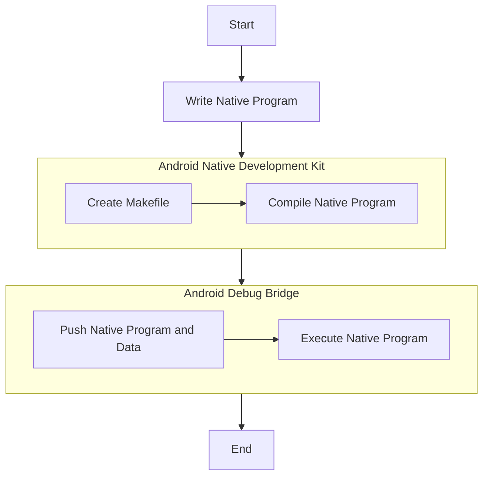

# Getting Started with Native Samples
This guide provides a detailed walkthrough for developing a native program using the Exynos Neural Network Software Development Kit (ENN SDK).
It describes the steps for developing a native program that leverages the ENN SDK to execute neural network models on Samsung Exynos hardware within the adb shell environment.
The guide aims at equipping developers with the necessary knowledge so that they can create native binaries for testing their models without having to create an Android application.

## The ENN SDK
The [ENN SDK](https://soc-developer.semiconductor.samsung.com/development/enn-sdk) tool facilitates the conversion of [TensorFlow Lite](https://www.tensorflow.org/lite) neural network models into NNC format models.
This conversion enables the NN models to execute efficiently on the [Samsung Exynos](https://semiconductor.samsung.com/processor/) hardware to ensure optimal performance.
The ENN SDK provides a framework that facilitates the execution of NNC models on the Exynos platform.

## Overview of the Sample Native Program
The sample native program accepts a model file and raw input data files as parameters.
If golden output data files are provided, the program compares these files and displays the result. If no file is provided, the program generates a raw output file.

### Model and Data Used
In this sample native program, a converted NNC file and raw input/output file available in the [Github Repository](https://github.com/exynos-eco/enn-sdk-samples-9925) are used.

### Using Native Program
To execute the sample native program, refer to [README](https://github.com/exynos-eco/enn-sdk-samples-9925/tree/main/nnc-model-tester#readme) file.

## Implementing Native Program
This guide comprises the following sections:
1. [**Writing Native Program**](getting-started-with-native-samples/writing-native-program): This section provides the process of writing a C++ program to implement the ENN framework.
1. [**Compiling Using NDK**](getting-started-with-native-samples/compiling-using-ndk): This section provides the step-by-step process to compile the native program using NDK.
1. [**Using ADB to Execute Native Program**](getting-started-with-native-samples/using-adb): This section explains the method to execute the native program using ADB.

The general workflow of writing and executing a native program using the ENN SDK is described in the following flowchart.

## Glossary
|Terms|Expanded Form|
|-|-|
|ENN SDK|Exynos Neural Network Software Development Kit|
|ERD Board|Exynos Reference Design Board|
|NN|Neural Network|
|NNC|Neural Network Container|
|TFLite|TensorFlow Lite|