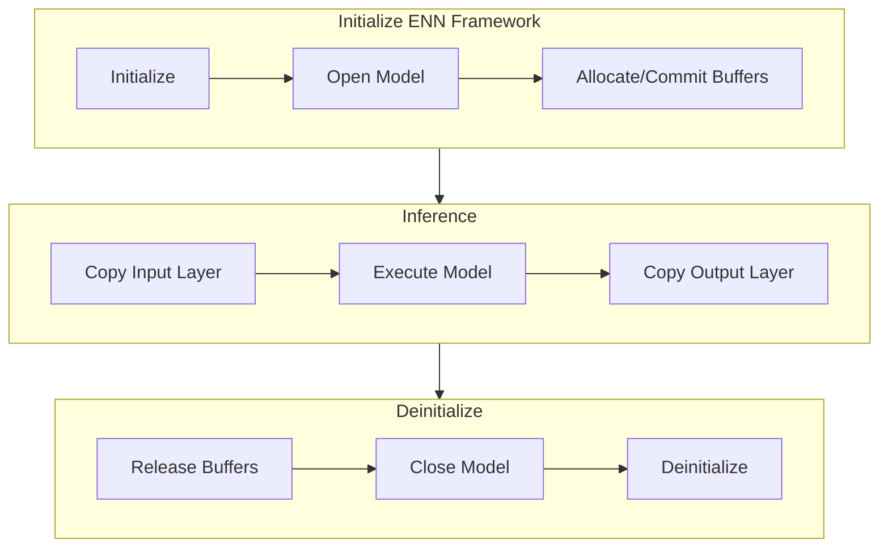

# Writing Native Program

## Introduction

### Program Flow
This program receives the locations of the model file, input file, and output file as parameters.
Initially, the program initializes the ENN SDK framework.
Subsequently, it opens the model and allocates the required buffers.
Then, it loads the input files into the specified buffer locations.
After this, the model is executed.

Post-execution, the program loads and compares the output with the output files that are provided.
If the output files are not available, it dumps the buffer data into a file.
Before the program terminates, it releases all the buffers, closes the model, and de-initializes the ENN SDK framework.

## Using ENN Framework on C++

### Copying Libraries 
Download the ENN framework library (ENN Public API NDK) from [resources](https://soc-developer.semiconductor.samsung.com/development/enn-sdk?landing=resource).
Next, copy the required libraries by performing the following:

1. Copy `libenn_public_api_ndk_v1.so` to `${APP_ROOT}/jni/lib64`
2. Copy `enn-api-public_ndk_v1.hpp` and `enn_api-type_ndk_v1.h` to `${APP_ROOT}/jni/include`
3. Add the following code in `en_nnc_model_tester.cpp` to load ENN framework.
    ([Example](https://github.com/exynos-eco/enn-sdk-samples-9925/blob/main/nnc-model-tester/jni/enn_nnc_model_tester.cpp#L13)):
    ```cpp
    #include "include/enn_api-public_ndk_v1.hpp"
    ```

For more information on the overall structure of the source, refer to the [File Structure](#a-file-structure) section.

## Processing Input and Outputs
The data such as the model file and input data are required for executing the program.
The model can be directly loaded by the framework using its path.
However, the input data must be copied to memory.

### Loading Input Files
To provide the data to the model, copy input data to the specified memory location.
Use the [EnnAllocateAllBuffer](api-reference/enn-framework-api-functions#function-ennallocateallbuffers) function to obtain the input memory location.

([example](https://github.com/exynos-eco/enn-sdk-samples-9925/blob/main/nnc-model-tester/jni/enn_nnc_model_tester.cpp#L161)):
```cpp
FILE *f = fopen(filename, "rb");
char *dst = reinterpret_cast<char *>(buffer_set[idx]->va);

size_t size;

fseek(f, 0, SEEK_END);
size = ftell(f);
fseek(f, 0, SEEK_SET);

fread(dst, 1, size, f);

fclose(f);
```

### Loading Golden Data and Comparing it with Output (Optional)
After executing the model, load the golden binary data into memory and compare it with the data in the output memory location of model.
This optional step validates whether the output of model matches the expected results.

Use the [EnnAllocateAllBuffer](api-reference/enn-framework-api-functions#function-ennallocateallbuffers) function to obtain the output memory location.

([example](https://github.com/exynos-eco/enn-sdk-samples-9925/blob/main/nnc-model-tester/jni/enn_nnc_model_tester.cpp#L133)):
```cpp
template <typename T>
int compare_data(T *data1, T *data2, int size, T threshold) {
    int diff = 0;
    for (int idx = 0; idx < size; idx++) {
        if (std::abs(data1[idx] - data2[idx]) > threshold) {
            diff++;
        }
    }

    return diff;
}
```

## Executing Model
This section describes the steps for executing NN models on the ENN framework.
For more information on the ENN framework, refer to the [documentation](developer-guide#4-enn-framework-api).

### Required Parameters
To execute NNC models using the ENN framework, the following parameters are required:

|Parameter|Data Type|Explanation|
|--|--|--|
|`model_name`|string|Path to the ML model file|
|`inputs`|vector&lt;string&gt;|List of input file paths|
|`goldens` (optional)|vector&lt;string&gt;|List of golden file paths for validation|
|`threshold` (optional)|float|Threshold for golden matching, used to determine the acceptable deviation|

### Writing ENN Framework Code
Executing NN models on the ENN framework comprises of three steps such as initializing the framework, inferring the models, and deinitializing the framework.

The following chart describes the lifecycle and process of inferring NN models using the ENN framework.




To infer multiple data, repeat `Inference`.

#### Preparing Framework and Model
Before executing ML models on the ENN framework, initialize the framework, load the model, and allocate the required buffers.

1. [EnnInitialize](api-reference/enn-framework-api-functions#function-enninitialize):
    This function initializes the ENN Framework.

    ([example](https://github.com/exynos-eco/enn-sdk-samples-9925/blob/main/nnc-model-tester/jni/enn_nnc_model_tester.cpp#L48)):
    ```cpp
    enn::api::EnnInitialize();
    ```

1. [EnnOpenModel](api-reference/enn-framework-api-functions#function-ennopenmodel):
    This function opens the specified model and returns a model ID.

    ([example](https://github.com/exynos-eco/enn-sdk-samples-9925/blob/main/nnc-model-tester/jni/enn_nnc_model_tester.cpp#L56)):
    ```cpp
    EnnModelId model_id;
    enn::api::EnnOpenModel(model_name.c_str(), &model_id);
    ```

1. [EnnAllocateAllBuffers](api-reference/enn-framework-api-functions#function-ennallocateallbuffers):
    This function allocates the required buffers for the model.
    It also provides the number of input/output buffers (`buffer_info`), their locations, and sizes (`buffer_set`).
    
    ([example](https://github.com/exynos-eco/enn-sdk-samples-9925/blob/main/nnc-model-tester/jni/enn_nnc_model_tester.cpp#L68)):
    ```cpp
    EnnBufferPtr *buffer_set;
    NumberOfBuffersInfo buffer_info;
    enn::api::EnnAllocateAllBuffers(model_id, &buffer_set, &buffer_info);
    ```

Following is the data structure of `EnnBufferPtr` and `NumberOfBuffersInfo`. 

```cpp
typedef struct _ennBuffer {
    void *va;
    uint32_t size;
    uint32_t offset;
} EnnBuffer;

typedef EnnBuffer* EnnBufferPtr;

typedef struct _NumberOfBuffersInfo {
    uint32_t n_in_buf;
    uint32_t n_out_buf;
} NumberOfBuffersInfo;
```

#### Executing Model
The execution phase of model involves copying the input layer, executing the model, and copying the output layer.
For more information on copying data to the input layer and comparing data with the output layer, refer to Section [Processing Input and Outputs section](#processing-input-and-outputs).

1. [EnnExecuteModel](api-reference/enn-framework-api-functions#function-ennexecutemodel):
    This function executes the model using the specified model ID.

    ([example](https://github.com/exynos-eco/enn-sdk-samples-9925/blob/main/nnc-model-tester/jni/enn_nnc_model_tester.cpp#L90)):
    ```cpp
    enn::api::EnnExecuteModel(model_id)
    ```

#### Deinitializing Framework
After executing the model, deinitialize the framework to release resources.

1. [EnnReleaseBuffers](api-reference/enn-framework-api-functions#function-ennreleasebuffers):
    This function releases the allocated buffers.

    ([example](https://github.com/exynos-eco/enn-sdk-samples-9925/blob/main/nnc-model-tester/jni/enn_nnc_model_tester.cpp#L112)):
    ```cpp
    enn::api::EnnReleaseBuffers(buffer_set, buffer_info.n_in_buf + buffer_info.n_out_buf)
    ```

1. [EnnCloseModel](api-reference/enn-framework-api-functions#function-ennclosemodel):
    This function closes the specified model.

    ([example](https://github.com/exynos-eco/enn-sdk-samples-9925/blob/main/nnc-model-tester/jni/enn_nnc_model_tester.cpp#L118)):
    ```cpp
    enn::api::EnnCloseModel(model_id)
    ```

1. [EnnDeinitialize](api-reference/enn-framework-api-functions#function-enndeinitialize):
    This function deinitializes the ENN framework.

    ([example](https://github.com/exynos-eco/enn-sdk-samples-9925/blob/main/nnc-model-tester/jni/enn_nnc_model_tester.cpp#L124)):
    ```cpp
    enn::api::EnnDeinitialize()
    ```

## Appendix

### A. File Structure
- `example`: This directory contains an example model and its corresponding input files.
- `jni`: This directory includes source code, build files, and libraries.
    - `include`: A subdirectory that contain the required header files.
    - `lib64`: A subdirectory that contain the shared library.
    - `*.mk`: Various build files.
    - `enn_nnc_model_tester.cpp`: Source code for the sample program.
- `libs`:  This directory contains the built program and required libraries.
