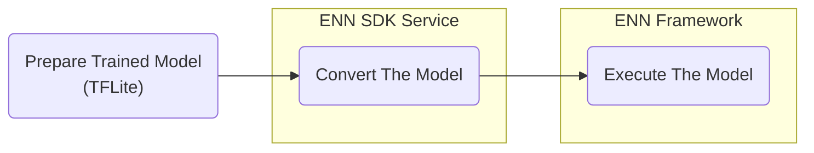

# Quick Start Guide

## Abstract
This guide provides basic instructions for using Exynos Neural Network Software Development Kit (ENN SDK).
This guide explains the method to convert Neural Network (NN) models to Neural Network Container (NNC) models.
It also describes the execution of NNC models on Exynos devices.

## Introduction
[ENN SDK](https://soc-developer.semiconductor.samsung.com/development/enn-sdk) allows users to convert the trained [TensorFlow Lite](https://www.tensorflow.org/lite) neural network models to a format that can run efficiently in [Samsung Exynos](https://semiconductor.samsung.com/processor/) hardware.
ENN SDK contains ENN SDK service to convert trained NN models and ENN framework for executing converted models on Exynos platforms.

This guide covers the basics of using [ENN SDK service](https://soc-developer.semiconductor.samsung.com/development/enn-sdk/project/) and executing NN models with ENN framework.

## Basic Workflow
Following figure illustrates the three steps for converting and executing an NN model:



### Model Conversion
To convert TensorFlow Lite models, ENN SDK provides an online conversion tool through the Samsung [Exynos Developer Society](https://soc-developer.semiconductor.samsung.com/development/enn-sdk/project/).
This online conversion tool allows users to upload their TFLite models, convert them to NNC models, and download the NNC models to their devices.

For more information on the process of converting NN models, refer to [Converting NN Models with ENN SDK Service](#converting-nn-models-with-enn-sdk-service).

### Model Execution
To execute NNC models on Exynos platforms, users must implement a program with ENN framework.
ENN framework provides C++ APIs for utilizing the framework that accelerate graph-based NN applications using NPU/DSP.
The ENN SDK provides only C++ APIs.
Therefore, the user must implement the Java Native Interface (JNI) layer to use the ENN framework on Android applications.

For more information on the process of executing NN models, refer to [Executing Models Using Native Program](#executing-models-using-native-program) and [Executing Models Using Android Application](#executing-models-using-android-application).

## Example Using ENN SDK

### Converting NN Models with ENN SDK Service
In this example, let us consider converting a trained TFLite MobileNet V1 model from TensorFlow Hub. 

To get started, you must be a member of the [Exynos Developer Society](https://soc-developer.semiconductor.samsung.com/). 
  - If you are not a member of the Exynos Developer Society, sign up from [here](https://soc-developer.semiconductor.samsung.com/register). 
  - If you already have an account, log in to the Exynos Developer Society.

To convert MobileNet V1 model:
1. Download `lite-model_mobilenet_v1_100_224_uint8_1.tflite` from [here](https://www.kaggle.com/models/iree/mobilenet-v1/frameworks/tfLite/variations/100-224-uint8/versions/1).
1. Navigate to the ENN SDK service [page](https://soc-developer.semiconductor.samsung.com/development/enn-sdk/project/) and provide a title for your project. 
1. Then, upload the downloaded TFLite model
1. Next, select hardware preferences. 
    - The **Default** option creates a model that utilizes only the CPU and GPU for conversion. 
    - The **Accelerate** option creates a model that utilizes NPU as an accelerator with CPU and GPU. 
1. After confirming your selections, click **Convert** to convert the model.
1. After the compilation process is successfully completed, the **NNC Download** button is enabled. 
1. Click **NNC Download** to download the converted NNC model. 
You can now integrate the NNC model into the desired application.

### Executing Models Using Native Program
For this example, we will execute a sample NNC model using the native program on the ERD board.
The sample program is available at `enn-sdk-samples-9925/nnc-model-tester` within the [Github repository](https://github.com/exynos-eco/enn-sdk-samples-9925).

1. Download the samples and navigate to the directory that contain the sample program.
    ```shell
    git clone https://github.com/exynos-eco/enn-sdk-samples-9925.git
    cd enn-sdk-samples-9925/nnc-model-tester
    ```

1. Push the necessary files (native program and test files) using adb push.
    ```shell
    adb push libs/arm64-v8a/enn_nnc_model_tester /data/local/tmp/
    adb push libs/arm64-v8a/libenn_public_api_ndk_v1.so /data/local/tmp/
    adb push example/model.nnc /data/local/tmp/
    adb push example/input.bin /data/local/tmp/
    adb push example/golden.bin /data/local/tmp/
    ```

1. When nnc_model_tester is built from Windows, execute permission must be provided.
    ```shell
    adb shell "chmod +x /data/local/tmp/enn_nnc_model_tester"
    ```

1. Execute native binary on ERD board using adb shell.
    ```shell
    adb shell
    cd /data/local/tmp/
    export LD_LIBRARY_PATH=/data/local/tmp 
    ./enn_nnc_model_tester --model model.nnc --input input.bin --golden golden.bin --threshold 0.0001
    ```

1. When the command is successful, the following message is displayed:
    ```shell
    Loaded Model:
            model.nnc(00000B7E01000000)
    Model Execution Time (1): 5413 microseconds
    Avg. Model Execution Time: 5413 microseconds
    Output Layer(0): Golden Match
    -       snr value:104.802
    ENN Framework Execute Model Sucess
    ```

For more information on this sample program, refer to [ENN SDK Samples](enn-sdk-samples).
For more information on writing native programs using ENN framework, refer to [Getting Started With Native Samples](getting-started-with-native-samples).

### Executing Models Using Android Application
For this example, we will execute an Android application using Android Studio on the ERD board. 
This example allows users to execute an image classification Android application.

The source code for the example is available at `enn-sdk-samples-9925/image-classification` within the [Github repository](https://github.com/exynos-eco/enn-sdk-samples-9925).
1. Download the samples by cloning the Github repository
    ```shell
    git clone https://github.com/exynos-eco/enn-sdk-samples-9925.git
    ```
2. Open the downloaded **image-classification** project in Android Studio. 
3. Connect the ERD board and click "run 'app'".
  The application is launched on the ERD board after the build.

For more information, refer to [Getting Started With Android Samples](getting-started-with-android-samples).
