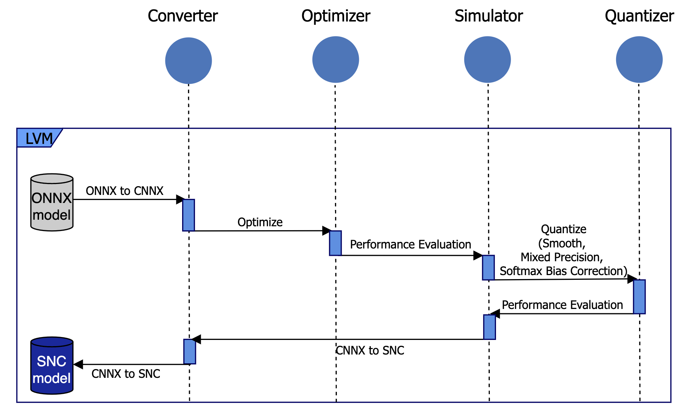
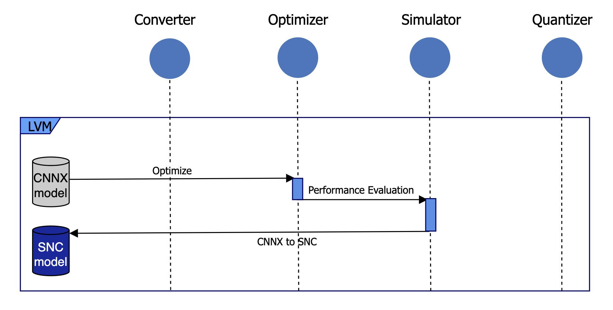

# Model Optimization Flow

This section details the optimization flow according to model type. Currently, optimization scenarios are predetermined for specific model types, including computer vision (CV) models, large language models (LLM), and large vision models (LVM). We plan to update the features to allow flexible scheduling of optimization functions.

## CV

1. **ONNX-to-CNNX Conversion**

    Converts an opset16 ONNX model to CNNX format.

    output_path : `{result_dir}/cnnx`

2. **Optimization**

    Passes the CNNX model through Simplifier and applies an Optimization template.

    output_path : `{result_dir}/optimized`

3. **Performance Evaluation of Optimization**

    Compares the inference results of the model before and after optimization.

4. **Quantization**

    Applies Fixed Precision Quantization to the optimized CNNX model.

    output_path : `{result_dir}/quantized`

5. **Performance Evaluation of Quantization**

    Compares the inference results of the model before and after quantization.

6. **CNNX-to-SNC Conversion**

    Converts the CNNX model to SNC format.

    output_path : `{result_dir}/snc`

## LVM

1. **ONNX-to-CNNX Conversion**

    Converts an opset16 ONNX model to CNNX format.

    output_path : `{result_dir}/cnnx`

2. **Optimization**

    Passes the CNNX model through Simplifier and 4-Dimensional Conversion. Afterwards, an Optimization template is applied.

    output_path : `{result_dir}/optimized`

3. **Performance Evaluation of Optimization**

    Compares the inference results of the model before and after optimization.

4. **Quantization**

    Applies the Smooth Quantization, Mixed Precision Quantization, and Softmax Bias Correction methods sequentially to the CNNX FP32 model.

    output_path :

    `{result_dir}/smoothquant`

    `{result_dir}/mixed_precision_quant`

    `{result_dir}/softmax_bias_correction`

5. **Performance Evaluation of Quantization**

    Compares the inference results of the model before and after quantization.

6. **CNNX-to-SNC Conversion**

    Converts the CNNX model to SNC format.

    output_path : `{result_dir}/snc`

## LLM

1. **Optimization**

    Passes the CNNX model through Simplifier and 4-Dimensional Conversion. Afterwards, an Optimization template is applied.

    output_path : `{result_dir}/cnnx`

2. **Performance Evaluation of Optimization**

    Compares the inference results of the model before and after optimization.

    output_path : `{result_dir}/optimized`

3. **CNNX-to SNC Conversion**

    Converts the CNNX model to SNC format.

    output_path : `{result_dir}/snc`