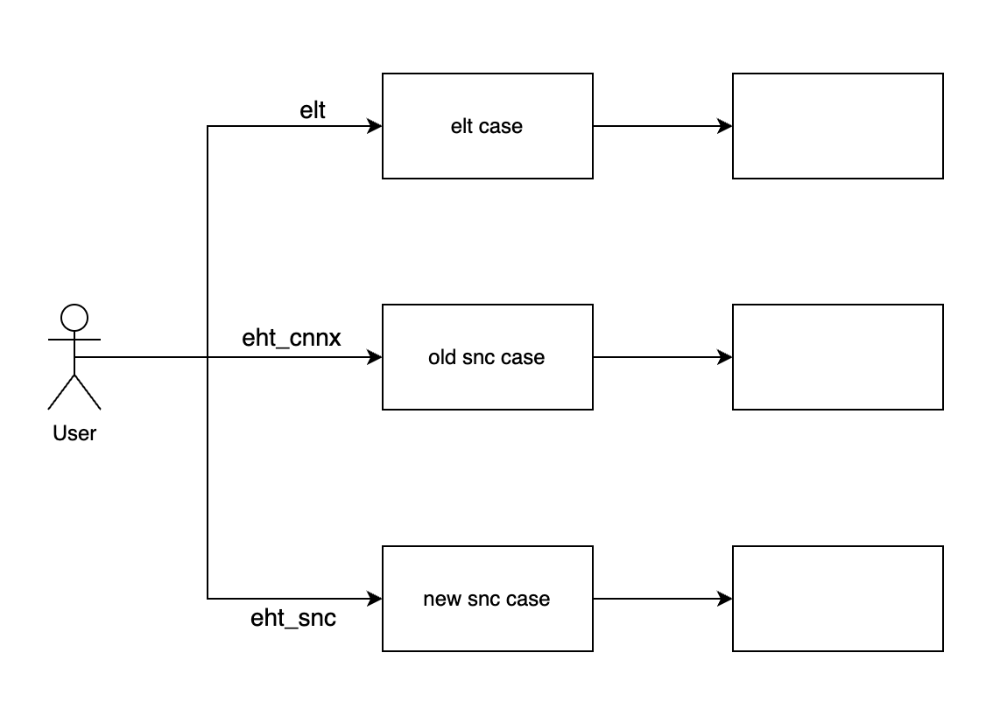

# **How to use**

### `enntools initialization`

To run enntools, you first need to create a folder and place an ONNX file with the same name as the folder inside it. Then you must initialize the project. When you initialize the project, the necessary files for using enntools commands will be generated inside the project directory.

```bash
enntools init
```

### **elt yaml file**

These are the configuration values used in various modules of elt.

### **Detailed explanation for elt yaml file**

---
**model_analyzer : dict**
- **check : bool** : Check the op support status
- **device : str** : System on Chip type [Gen-5, Gen-5a, Gen-5b, Gen-6]
- **level : int** :  level for analyze model : 0 (OpCount), 1 (OpCount + Attribute), 2 (OpCount + Attribute + In/Out Shape), 3 (OpCount + Attribute + In/Out Shape + Mem Footprint)
- **snc_input : bool** : analyze the snc model, false: analyze the original model

---

**database_gen : dict**
- **database_spec : str** : genration dataset spec path (default path is {workspace}/DATA/db_spec.yaml)

---

**converter : dict**
- **device : str** : Soc type [Gen-2, Gen-2a, Gen-3, Gen-3DSP, Gen-4, Gen-4DSP, Gen-4Multi(only for fp16), Gen-5, Gen-5a, Gen-5b, Gen-6, Gen-7]
- **do_quantize : bool** : Enable quantization
- **eltsum_cvt : bool** : enable eltwise conversion process; eltsum -> concat + conv
- **graph_opt : str** : Graph Optimizer Model Type, Model Name for Graph Optimizer.
- **mean : str** : Mean value(s), for multiple channel "128, 128, 128, ..." / y=x-MEAN
- **onnx_simplify : bool** : enable onnx_simplify process
- **optimize : bool** : Use graph optimization
- **quantize_type : str** : Select quantization type, quantized model (include caffeQAT) is "qat"
- **scale : str** : Scale value(s), for multiple channel "128, 128, 128, ..." / ex> y=x/SCALE
- **bw_ofm : int** : Bitwidth of intermediate feature map(A).
- **data_format : str** : [channel_first, channel_last]
- **debug : bool** : dump layerwise sqnr between new snc and hw quantized snc.
- **gpu_enable : bool** : enable infer model on gpu if gpu is available
- **gpu_id : int** : gpu id for quantization profiling
- **input_dtype : str** : [float32, float16, uint8, uint16, none] You can set model input datatpye as float32, uint8(only Asym)(if none take from model).
- **mode : str** : [elt, eht_cnnx, eht_snc]
- **output_dtype : str** : You can set model output datatpye as float32, uint8(only Asym)(if none take from model). [float32, float16, uint8, uint16, none] 
- **profile_batchsize : int** : Batchsize for profile (value 100 is recommened).
- **skip_old_snc_optimizer : bool** : true, skip old snc optimizer in old2new
- **snc_converter : bool** : True, convert old snc to new snc, set it to false when input is new snc
- **test_vector_gen : bool** : Enable testvector geneartion after quantization.
- **tv_input : str** : Input data file path for testvector generation (default path is {workspace}/DATA/database.h5)
- **use_randomdb : bool** : Use randomdb for profiling data set
- **userdb : str** : Profling data set path (default path is {workspace}/DATA/database.txt)

---

**compiler : dict**
- **assign_cpu : str** : Assign specific layer to cpu device
- **assign_dsp : str** : Assign specific layer to dsp device
- **assign_gpu : str** : Assign specific layer to gpu device
- **best_fit_generalized : bool** : Control whether generalized best fit allocation is to be used.
- **cast_in : str** : Type casting fp32 to fp16 for nnc input data
- **cast_out : str** : Type casting fp16 to fp32 for nnc output data
- **cfs : bool** : Enable cfifo sync
- **compiler : str** : Compiler option
- **datalayout_conversion_in : str** : Data layout(NHWC) conversion for nnc input data
- **datalayout_conversion_out : str** : Data layout(NHWC) conversion for nnc output data
- **debug_str : str** : debug str for compiler
- **dequant_type : str** : dequantiztion type
- **device : str** : System on Chip type [Gen-3, Gen-3b, Gen-4, Gen-5, Gen-5a, Gen-5b, Gen-6, Gen-7]
- **enable_ofm_reuse : bool** : Enable the reuse of OFM region for IMFM.
- **enable_stm : bool** : Generate compile log including L1 tiling information
- **flc : bool** : Enable featuremap lossless compression
- **fp16_swwa : bool** : Enable NPU fp16 workaround with psum_init
- **input_conversion : str** : Add a Tensor2Cell format converter node at start of network
- **mi : bool** : multiple input compile
- **mo : bool** : multiple output compile
- **multi_ncp : bool** : generate multi-ncp(ucgo) custom op
- **multi_vc : bool** : Introduce Multi-VC for OFM, IFM, and weight transfer
- **multicore : bool** : Enable NPU multicore
- **optimization : str** : Optimization choice [O1, O2, O3]
- **output_conversion : str** : Add a Tensor2Cell format converter node at end of network
- **packed_ucgo : bool** : true: generate one ucgo in nnc, false: generate multiple ucgos in nnc if there are multiple independent dsp OPs
- **preemption : bool** : Setting priority of NNC while compiling
- **quant_type : str** : quantiztion type
- **sync_npu_dsp : bool** : 

---

**simulator : dict**
- **data_format : str** : Indicate the position of channel of input [channel_first, channel_last]
- **use_randomdb : bool** : Use randomdb to forward, just support single input
- **userdb : str** : Simulation data set path (default path is {workspace}/DATA/data.txt)

---

**perf_estimator : dict**
- **O2_enable : bool** : O2 optimization (true or false)
- **O2_fm_forwarding : bool** : feature-map forwarding (true or false)
- **SEG : bool** : Set true if input model is Deeplab V3+
- **SSD : bool** : Set true if input model is SSD detection
- **bit_width_factor_FM : int** : Select feature map bit width factor (1 or 2)
- **bit_width_factor_FP16 : bool** : Set bit width factor as floating point (true or false)
- **bit_width_factor_weight : int** : Select weight bit width factor (1 or 2)
- **core_num : int** : 1 for single core, 2 for instance-1
- **device : str** : Select device type [Gen-3, Gen-4, Gen-5, Gen-5a]
- **json_report : bool** : Enable report json format
- **nq_fold : bool** : Speed-up by folding normalization parameters for input data (true: model input dtype is uint8, false: model input dtype is float32)

---

**profiler : dict**
- **iter : int** : This decides how many time the model inference will be processed.
- **mode : str** : 1. Low power mode : Mode for low power consumption and low performance. 2. Balanced mode : Mode for medium power consumption and medium performance. 3. Performance mode : Mode for high power consumption and high performance. 4. Boost mode : Mode for very high power consumption and very high performance. [lowpower, balanced, performance, boost]
- **target : str** : profiling target. [model, system]
- **test_type : str** : ENN running mode [lib, service]
- **tv_threshold : float** : The value is used for tolerance threshold of output match verification.
- **bitmatch_test : bool** : if set true, visual profiler will compile nnc first
- **core_num : str** : The number of NPU core. [single, multiple]
- **device : str** : Target device. [Gen-3, Gen-4, Gen-5, Gen-5a, Gen-6, Gen-6npu, Gen-7]
- **device_id : str** : id of the device connected to the server or PC running the enntools docker
- **remote_ssh_config_path : str** : remote testing ssh config path (default path is {workspace}/DATA/remote_ssh_config.yaml)
- **ssh_bool : str** : Connect to the device through ssh. [SSH_FALSE, SSH_TRUE]

---

### **eht yaml file**

The optimization file contains optimization information. It allows you to set the locations of input and output models and detailed configurations for each module. Optimization is performed differently depending on the model type.

### **Detailed explanation for eht yaml file**

---

**model_type : string**

Specify the type of the input model. Optimization is performed differently depending on the model type, with details as follows

- CV
- LVM
- LLM

---

**quantizer : dict**

- **precision_weight : str** : precision of weight(ex. int8, int16, fp16)
- **precision_activation : str** : precision of activation(ex. int8, int16, fp16)
- **mpq_operator_dict : dict** : When performing mixed precision quantization, input the operators and precision to be quantized with a precision different from the values specified in precision_weight and precision_activation above.
- **alpha : float** : smoothquant migration strength
- **calibration_data_path : string** : The path to the representative data to be used for calibration
- **calibration_args : dict :** Arguments for processing calibration
  - **samples : int** : How many calibration data samples to use
  - **seed : int** : A value set as a seed for random selection
- **add_dummy_conv: bool** : Whether apply the dummy conv algorithm
- **input_dtype: dict** : Input data type for the quantized model
- **output_dtype: dict** : Output data type for the quantized model

---

**simulator : dict**

- **metric : string**: The metric to be used for measurement
- **threshold : float** : The threshold value of the metric that determines agreement / disagreement
- **input_data_path : string**: The path to the dataset for model inference

---

**optimizer : dict**

- **skip_4_dim_conversion : bool** : If true, it does not convert to 4 dimensions before optimization; if false, it proceeds with the conversion.
- **overwrite_input_shapes : dict** : Enter the input shape for models with undefined input shapes.
- **custom_template_path : dict**: Enter the templates to apply for optimization. Use the path of the Python file containing the template as the key, and the template within it as the value.

### `enntools conversion`

When performing conversion, users can choose between using eht and elt depending on the mode. The detailed workflow is illustrated in the figure below.



```bash
enntools conversion
```
