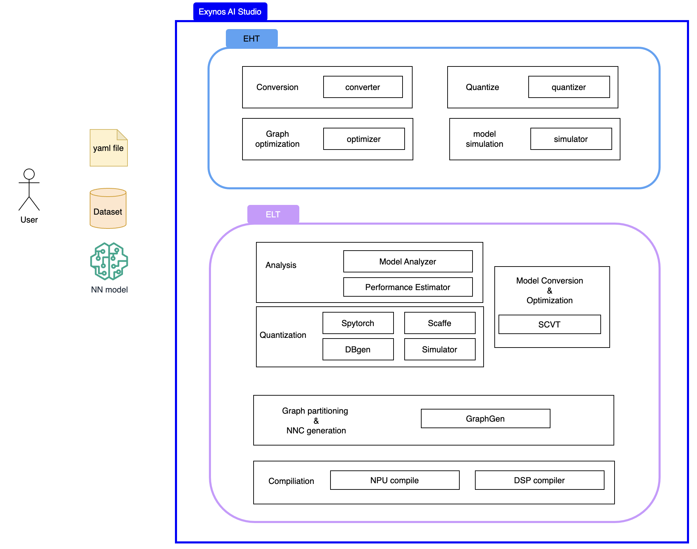

# Introduction to Exynos AI Studio

**Exynos AI Studio** is a software that provides optimization and conversion techniques for neural networks models. This software takes models as input and offers functionalities such as quantization, conversion, optimization, compilation to generate NNC models.

## System overview diagram

