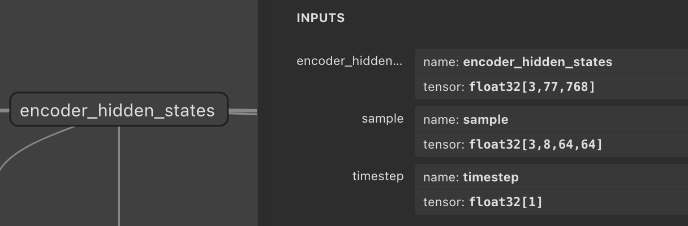
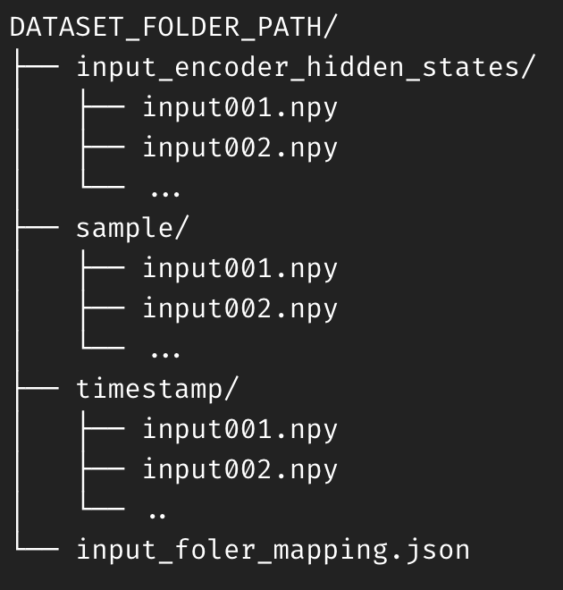

# **Dataset preparation**

This is a guideline for preparing the input dataset for the simulator and calibration dataset for the quantizer module.

### **Detailed instruction for dataset preparation**

Analyze model inputs using Netron. The example model receives three inputs: encoder_hidden_states, sample, and timestep.



Create a JSON file named 'input_folder_mapping.json'. In this file, define key-value pairs where each key represents a model input name and its corresponding value is the name of the folder containing the input data for that model input.
```json
{
    "encoder_hidden_states": "input_encoder_hidden_states",
    "sample": "sample",
    "timestep": "timestep"
}
```

After preparing the dataset and JSON file, create a dataset directory and place it in the specified location.




It's important to note that the file names for each input should be identical, as shown in the example above.

### Dataset Format Support

Currently, the supported data type is npy files consisting of float type. Support for other data formats is planned for the future.
| Data Format                                              | Support |
|--------------------------------------------------------|---------|
| [numpy array(.npy, float)]( files/test_dataset.zip ) | O       |
| numpy array(.npy, int)                                 | TBD     |
| binary data(.bin)                                      | TBD     |
| image(.jpg)                                            | TBD     |
