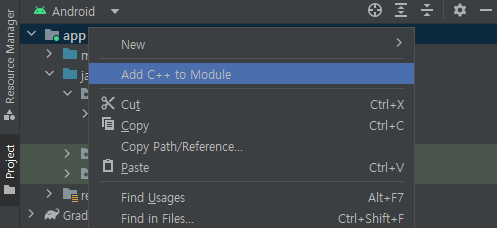
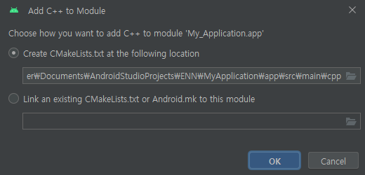
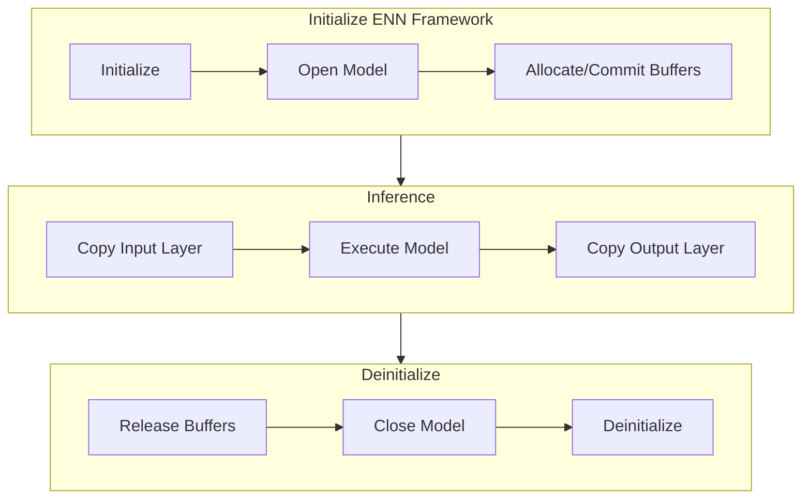

# ENN Framework

## Using ENN Framework on Android

### Adding C++ to Module
1. Right click **Project** panel with **Android** option being selected.

    

1. Select the **Add C++ to Module** option and click OK.

    

### Loading Libraries
Download the ENN framework library from [resources](https://soc-developer.semiconductor.samsung.com/development/enn-sdk?landing=resource).
To load the necessary libraries, perform the folowing steps:

1. Modiy Android Manifest to:
	```xml
	<manifest>
		<application>
			...
			<!-- Declare the native library in the Android Manifest -->
			<uses-native-library android:name="libenn_user.samsung_slsi.so" />
			...
		</application>
	</manifest>
	```

1. Copy `libenn_public_api_ndk_v1.so` to `${APP_ROOT}/app/src/main/jniLibs/arm64-v8a`.
1. Copy `enn-api-public_ndk_v1.hpp` and `enn_api-type_ndk_v1.h` to `${APP_ROOT}/app/src/main/cpp/include`.
1. Modify `CMakeLists.txt` that is created [here](#adding-c-to-module).

	```cmake
	# Include the directory where the header files are located
	include_directories(include)

	# Declare the imported shared library
	add_library(
		enn_service_so
		SHARED
		IMPORTED
	)

	# Set the location of the imported library
	set_target_properties(
		enn_service_so
		PROPERTIES IMPORTED_LOCATION
		${CMAKE_SOURCE_DIR}/../jniLibs/${ANDROID_ABI}/libenn_public_api_ndk_v1.so
	)
		
	# Link the imported library to the target library
	target_link_libraries(
		...
		enn_service_so
		...
	)
	```

### Specifying ABI

The ENN framework currently supports only the `arm64-v8a` ABI. To set ABI, modify the `build.gradle` file and specify the ABI as `arm64-v8a`.
```
defaultConfig {
	...
	ndk {
		abiFilters "arm64-v8a"
	}
	...
}
```

### Creating a Java Native Interface Library
The Java Native Interface (JNI) is a framework that allows Java code to interact with the code written in other languages such as C or C++. In the sample application, JNI accesses features or libraries such as the ENN framework that are written in C or C++.

1. Create `enn_jni.cc` in `cpp` directory.
1. Modify `CMakeLists.txt` created [here](#adding-c-to-module).

    ```cmake
    add_library(
        enn_jni
        SHARED
        enn_jni.cc
    )

    target_link_libraries(
        enn_jni
    )
    ```

#### Writing JNI Library
Following function is an example of an implemented JNI wrapper.     
For more information, refer to the  [Android Developer Documentation](https://developer.android.com/ndk/samples/sample_hellojni).

([example](https://github.com/exynos-eco/enn-sdk-samples-9925/blob/main/image-classification/app/src/main/cpp/enn_jni.cc#L57)):
```cpp
extern "C"
JNIEXPORT jlong JNICALL
Java_com_samsung_imageclassification_executor_ModelExecutor_ennOpenModel(
        JNIEnv *env,
        jobject thiz,
        jstring j_filename
) {
    EnnModelId model_id;
    const char *filename = env->GetStringUTFChars(j_filename, 0);

    if (enn::api::EnnOpenModel(filename, &model_id)) {
        __android_log_print(ANDROID_LOG_ERROR, LOG_TAG, "EnnOpenModel of [%s] Failed", filename);
    }

    return static_cast<jlong>(model_id);
}
```

#### Using JNI Library from Kotlin
Following is an example for using JNI function in Kotlin.
1. Load the JNI library
([example](https://github.com/exynos-eco/enn-sdk-samples-9925/blob/main/image-classification/app/src/main/java/com/samsung/imageclassification/executor/ModelExecutor.kt#L42)):
	```kotlin
	init {
		System.loadLibrary("enn_jni")
		...
	}
	```
2. Declare the external function
([example](https://github.com/exynos-eco/enn-sdk-samples-9925/blob/main/image-classification/app/src/main/java/com/samsung/imageclassification/executor/ModelExecutor.kt#L28)):
	```kotlin
	private external fun ennOpenModel(filename: String): Long
	...
	```
3. Use the JNI function ([example](https://github.com/exynos-eco/enn-sdk-samples-9925/blob/main/image-classification/app/src/main/java/com/samsung/imageclassification/executor/ModelExecutor.kt#L54)):
	```kotlin
	//  to open a model
	private fun setupENN() {
		...
		modelId = ennOpenModel(fileAbsoluteDirectory)
		...
	}
	```

## Process of Inference with ENN Framework

### Lifecycle of Model Inference
Following flowchart describes the lifecycle of inferring NN models using ENN framework.



To infer multiple data, repeat `Inference` process.

### List of Implemented Native Functions
Following table describes the implemented native functions for the sample application.

| Method | Description | Inputs | Outputs |
| --- | --- | --- | --- |
| [`ennInitialize`](https://github.com/exynos-eco/enn-sdk-samples-9925/blob/main/image-classification/app/src/main/cpp/enn_jni.cc#L35) | Initialize the ENN framework | - | - |
| [`ennDeinitialize`](https://github.com/exynos-eco/enn-sdk-samples-9925/blob/main/image-classification/app/src/main/cpp/enn_jni.cc#L46) | Deinitialize the ENN framework | - | - |
| [`ennOpenModel`](https://github.com/exynos-eco/enn-sdk-samples-9925/blob/main/image-classification/app/src/main/cpp/enn_jni.cc#L57) | Open a Model from the model file. | `filename`: String - Directory of the model `nnc` file | `modelID`: Long - Model ID. |
| [`ennCloseModel`](https://github.com/exynos-eco/enn-sdk-samples-9925/blob/main/image-classification/app/src/main/cpp/enn_jni.cc#L74) | Close the model and free up all resources from `ennOpenModel`. | `modelId`: Long - Model ID from `ennOpenModel`. | - |
| [`ennAllocateAllBuffers`](https://github.com/exynos-eco/enn-sdk-samples-9925/blob/main/image-classification/app/src/main/cpp/enn_jni.cc#L86)  | Allocate all buffers that a caller should allocate. | `modelID`: Long - Model ID from `ennOpenModel` | `bufferSetInfo`: BufferSetInfo - Custom class that includes pointer and size of the EnnBuffer array. |
| [`ennReleaseBuffers`](https://github.com/exynos-eco/enn-sdk-samples-9925/blob/main/image-classification/app/src/main/cpp/enn_jni.cc#L103) | Release buffer array from `ennAllocateAllBuffers` | `bufferSet`: Long - pointer of buffer set array.<br>`bufferSize`: Int - total number of buffers. | - |
| [`ennExecute`](https://github.com/exynos-eco/enn-sdk-samples-9925/blob/main/image-classification/app/src/main/cpp/enn_jni.cc#L118) | Request to service core to execute model with committed buffers | `modelId`: Long - Model ID from `ennOpenModel`. | - |
| [`ennMemcpyHostToDevice`](https://github.com/exynos-eco/enn-sdk-samples-9925/blob/main/image-classification/app/src/main/cpp/enn_jni.cc#L130) | Copy ByteArray to buffer array | `bufferSet`: Long - Pointer of buffer set array.<br>`layerNumber`: Int - Index of buffer.<br>`data`: ByteArray - ByteArray to copy. | - |
| [`ennMemcpyDeviceToHost`](https://github.com/exynos-eco/enn-sdk-samples-9925/blob/main/image-classification/app/src/main/cpp/enn_jni.cc#L150) | Copy ByteArray from buffer array | `bufferSet`: Long - Pointer of buffer set array.<br>`layerNumber`: Int - Index of buffer. | `data`: ByteArray - Copied ByteArray. |


### Using Implemented Native Functions
To execute the NN models with implemented native functions, perform the following steps.

1. Preparing Execution of Model
	1. Initialize the framework using the `ennInitialize` function.
	2. Load the ML model into the framework using the `ennOpenModel` function.
	3. Allocate and commit the necessary buffers using the `ennAllocateAllBuffers` function.
2. Executing a Model
	1. Set input data as a parameter.
	2. Call the `ennExecute` function.
	3. Get the execution result as a return.
3. Deinitializing the Framework
	1. Release the allocated memory of the buffers with the `ennReleaseBuffers` function.
	2. Close the model and release other resources with the `ennCloseModel` function.
	3. Deinitialize the framework with the `ennDeinitialize` function.
