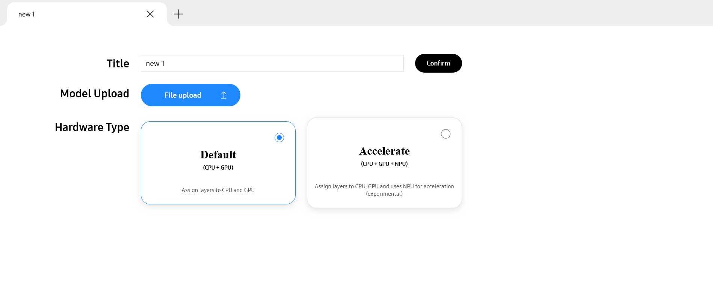
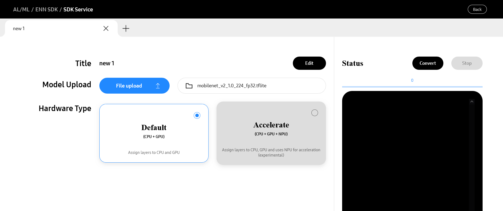

# ENN SDK

## ENN SDK Service
Use the [ENN SDK service](https://soc-developer.semiconductor.samsung.com/development/enn-sdk/project/) to convert trained TFLite models to NNC models by performing the following steps.

### Preparation
1. Access the Exynos Developer Society
    - If you are a new user, sign up to create an account.
    - If you are a returning user, log in to Exynos Developer Society.
1. Download Inception v4 `.tflite` model from [here](https://www.kaggle.com/models/tensorflow/inception/frameworks/tfLite/variations/v4-quant/versions/1).

### Project Creation
1. Navigate to the ENN SDK service [page](https://soc-developer.semiconductor.samsung.com/enn-sdk/project/).

    

1. Enter a descriptive title for your model.
1. For this guide, choose **Accelerate** hardware type.
    - **Default**: Utilizes only the CPU and GPU.
    - **Accelerate**: Engages the NPU as an additional accelerator. 
        > Warnig: NPU does not support all the models. 
            Choosing the ***Accelerate*** option may lead to complications.
1. After confirming the selections, the subsequent screen appears:

    

### Conversion
1. Select **Convert** to initiate the conversion process.
1. After the completion of conversion process, the **NNC Download** button is enabled.

### Download Model
1. Click **NNC Download** to obtain the converted NNC model file.
1. To view the logs for the conversion that has failed, click **Log Download**.
    You can download and examine the log files.
1. Copy the downloaded model to `${APP_ROOT}/app/src/main/assets`.